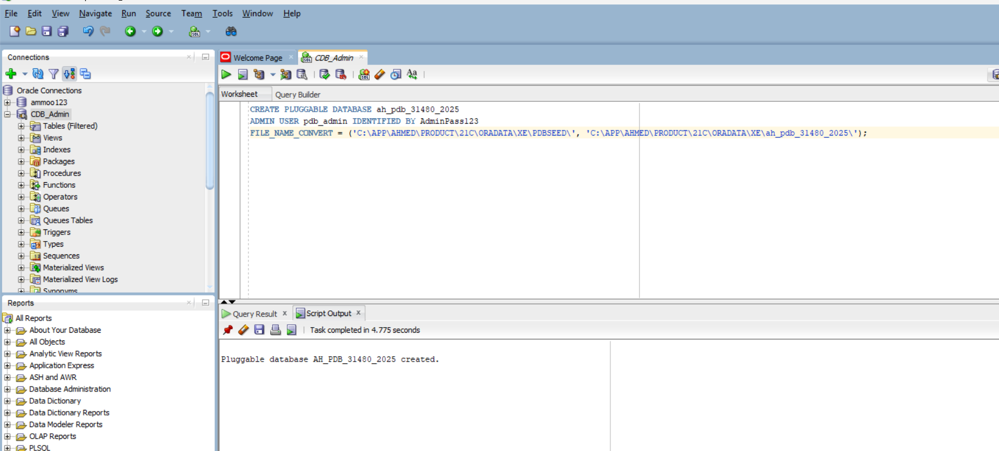
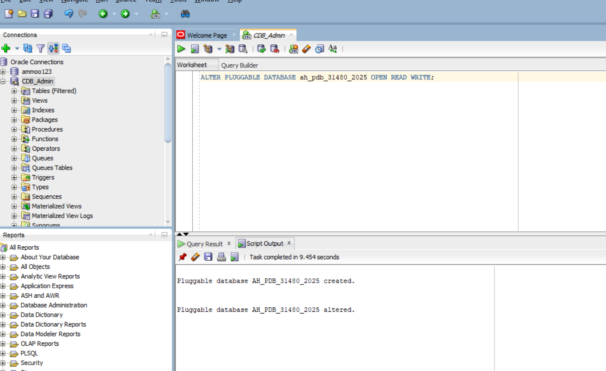
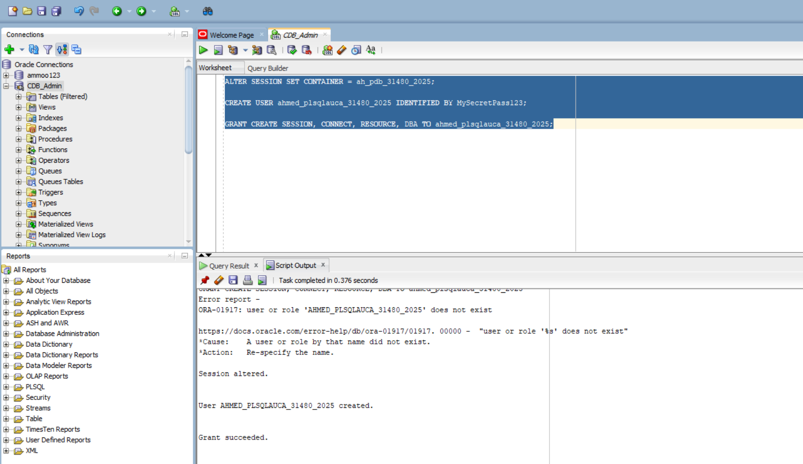
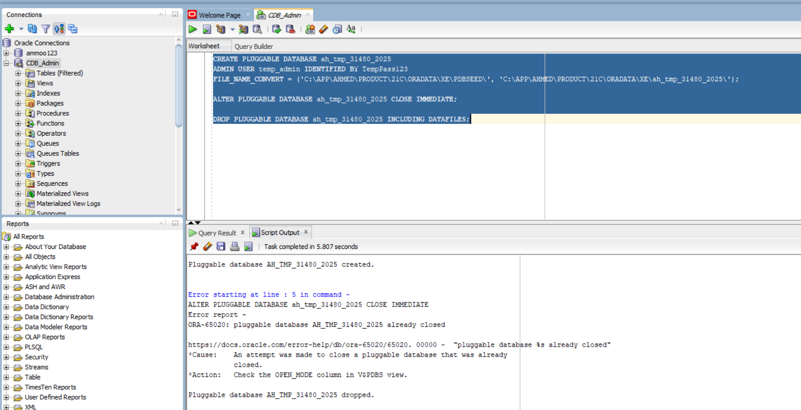
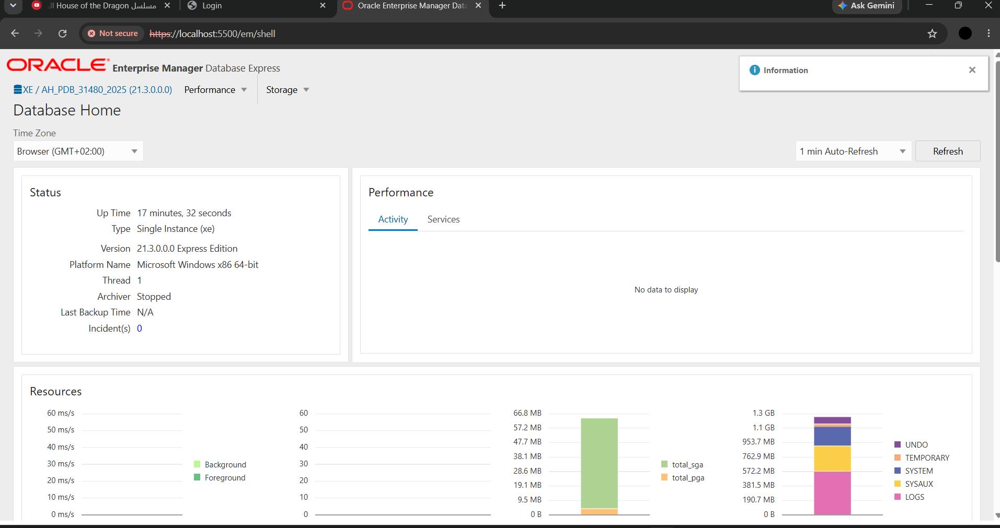

# Individual Assignment II: Oracle Pluggable Database (PDB) Administration
* **Student Name:** Ahmed
* **Student ID:** 31480/2025
* **Course:** Database Programming (C11665 – DPR400210)
* **Instructor:** Eric Maniraguha
* **Institution:** University of Lay Adventists of Kigali (UNILAK)

---

## Task 1: Create and Configure a New Pluggable Database (PDB)

### 1. PDB Creation Command and Output
```sql
CREATE PLUGGABLE DATABASE ah_pdb_31480_2025 
ADMIN USER pdb_admin IDENTIFIED BY AdminPass123
FILE_NAME_CONVERT = ('C:\APP\AHMED\PRODUCT\21C\ORADATA\XE\PDBSEED\', 'C:\APP\AHMED\PRODUCT\21C\ORADATA\XE\ah_pdb_31480_2025\');
```


### 2. PDB Open Status
```sql
ALTER PLUGGABLE DATABASE ah_pdb_31480_2025 OPEN READ WRITE;
```


### 3. User Creation and Granted Privileges
```sql
ALTER SESSION SET CONTAINER = ah_pdb_31480_2025;
CREATE USER ahmed_plsqlauca_31480_2025 IDENTIFIED BY MySecretPass123;
GRANT CREATE SESSION, CONNECT, RESOURCE, DBA TO ahmed_plsqlauca_31480_2025;
```


---

## Task 2: Create and Delete a Temporary PDB

```sql
ALTER SESSION SET CONTAINER = CDB\$ROOT;

CREATE PLUGGABLE DATABASE ah_tmp_31480_2025 
ADMIN USER temp_admin IDENTIFIED BY TempPass123
FILE_NAME_CONVERT = ('C:\APP\AHMED\PRODUCT\21C\ORADATA\XE\PDBSEED\', 'C:\APP\AHMED\PRODUCT\21C\ORADATA\XE\ah_tmp_31480_2025\');

ALTER PLUGGABLE DATABASE ah_tmp_31480_2025 CLOSE IMMEDIATE;

DROP PLUGGABLE DATABASE ah_tmp_31480_2025 INCLUDING DATAFILES;
```


---

## Task 3: Oracle Enterprise Manager (OEM) Configuration

